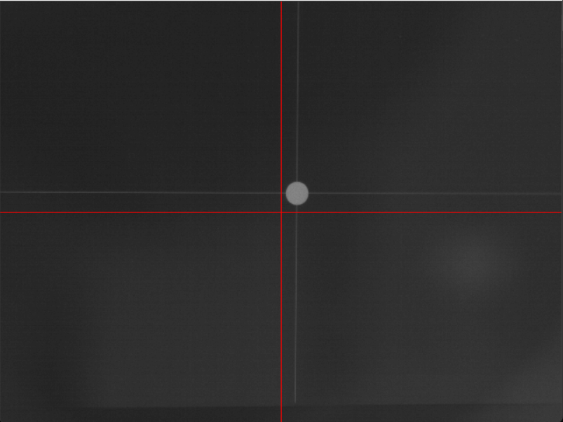
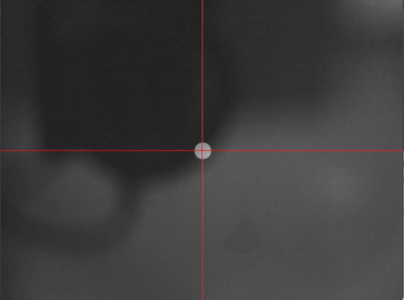
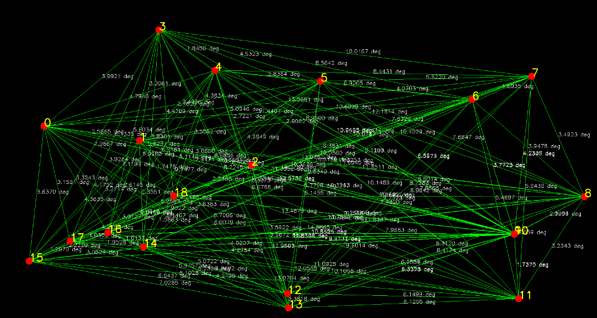
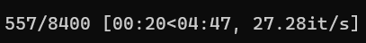

# How to Run Star Tracker Test System
### Author: Hongrui Zhao hongrui5@illinois
### Date: Jan/22/2024

## Step 1: Alignment
Open two separate terminals/powershell prompts.   

### 1.1 Terminal 1
Navigate to `star_tracker_test_System/starfield_simulator`.    
Go to `main.py`.   
Set `calib_flag = True` among simulation parameters.   
This will display a calibration target on the test system monitor indefinitely.  

### 1.2 Terminal 2
Navigate to `star_tracker_test_System/star_tracker_simulator_cal` folder.  
Run `main_calibration.py`.  
If the star tracker test system is unaligned, you will get something like this:  
{ width=35% }    
The focal length of the system is 350mm.   
The lens should be already sitting at the right spot (otherwise the white dot will be blurry).   
Adjust the angle and the height of the monitor so that you get something like below:  
{ width=35% }  
Press the key 'q' to close the camera.  
**Congratulation! You have aligned the star tracker test system!**

## Step 2: Displaying Starfield
In terminal 1, navigate to `star_tracker_test_System/starfield_simulator`.    
Go to `main.py`.   
Set `calib_flag = Fasle` among simulation parameters.   
### 2.1 Static Starfield
To display a static starfield, set `anime_flag = False`.  
You can also change the initial attitude quaternion `q`.  
To generate a random quaternion, just create a random 4x1 vector and normalize it.  
An angular distance map will also be generated, showing the groundtruth angles between pairs of star vectors.  
{ width=35% }  
If you only want to visualize angular distances for a subset of stars, set `selected_stars` to the star indices you want. For example for star 0, 1, 2: `selected_stars = np.array([0, 1, 2])`  
{ width=35% }  
### 2.2 Rotating Starfield
To display a static starfield, set `anime_flag = True`.  
You can also change the angular velocity `w` and the initial attitude quaternion `q`.  
To generate a random quaternion, just create a random 4x1 vector and normalize it.  
The rotating starfield will be running for 5 mins, you can change this time in `run_time`.  
Frame rate is set to 28 FPS (don't change it) and is fairly accurate, which makes sure the starfield is rotating at the correct speed.  
You can see the average running frame rate in the terminal, below it shows 27.28 FPS:  
{ width=35% }  

## Step 3: Star Detection and Centroiding
In terminal 2, navigate to `star_tracker_test_System/star_tracker_simulator_detect`.  

Use different baseline methods and tune their parameters inside function `def run_baseline(img)`.  
Change camera integration time at `camera_software_obj = camera_software(int_time=150)`.  

To run star detection and centroiding using our neural network method, input `python main_detection_centroiding.py --mode NN` in the terminal.  
To run star detection and centroiding using baseline methods, input `python main_detection_centroiding.py --mode baseline` in the terminal.  

Once the program is running, two windows will be displayed. One overlays detection results on the input camera images, one shows angular distance map.  
These two windows may be shown in the small monitor of the test system, drag them to your main PC monitor.  
Press the key 'q' to close the camera.  
Press the key 's' to save currently displayed content into the folder `/star_tracker_test_System/star_tracker_simulator_detect/saved_results.  

